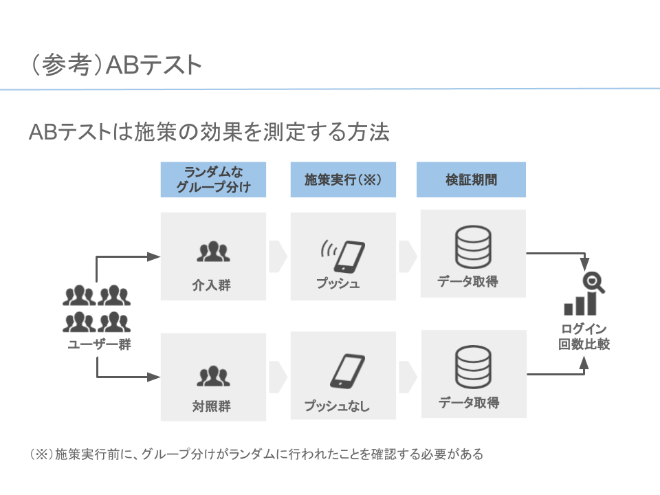

# AB testing

### 参考資料
- [kernelebb3430086 | Kaggle Kernel](https://www.kaggle.com/shweta112/a-b-testing-analysis/notebook)
    - A/Bテストに回帰を使う例。
- [A/Bテストに用いられれる統計的検定手法（ロジック）のまとめ＆比較 | RCO アドテク Lab ブログ](https://www.rco.recruit.co.jp/career/engineer/blog/ab-test-logic/)